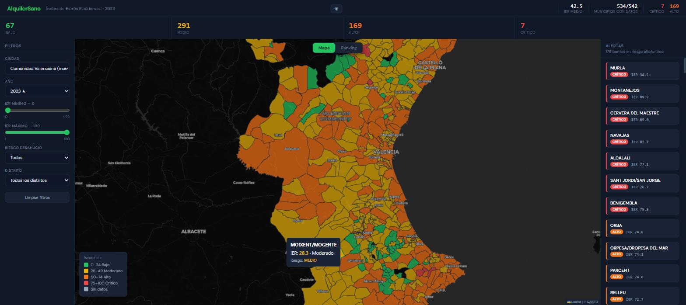

# AlquilerSano — Índice de Estrés Habitacional

Plataforma web que calcula el **Índice de Estrés Residencial (IER)** por municipio y barrio, cruzando datos de renta, pobreza y desigualdad del INE. Dashboard dark con mapa interactivo de la Comunidad Valenciana.

> El 20% de hogares con bajos ingresos en España destina más del 70% de su renta al alquiler (FOESSA 2025).

## 🖥️ Dashboard



Dark command center con:
- **Popup de bienvenida** explicando el estrés residencial y cómo leer el mapa
- **KPI cards** de distribución por riesgo (Bajo/Medio/Alto/Crítico)
- **Mapa dark** (CartoDB) con municipios coloreados por IER
- **Panel de filtros** (zona, año, rango IER, riesgo)
- **Panel de alertas** con municipios en riesgo alto/crítico
- **Vista ranking** (tabla ordenable)

## 🌐 Links

| Servicio | URL |
|----------|-----|
| **Demo en vivo** | https://omniwatch.tail83ece3.ts.net |
| **Autor** | [Fabrizio Bertolo en LinkedIn](https://www.linkedin.com/in/fabriziobertolo/) |
| **GitHub** | https://github.com/argtwo/alquilersano |

## Datos cargados

| Ámbito | Fuente | Registros | IER |
|--------|--------|-----------|-----|
| **CV municipios** | ADRH/INE (renta + pobreza + Gini) | 542 municipios × 9 años | 0.2–94.3 |
| **Valencia barrios** | Open Data Valencia vía CKAN (IBI + vulnerabilidad) | 88 barrios | 0.0–94.3 |
| Madrid / Barcelona | Pendiente | — | ⏳ |

### Distribución IER municipios CV (2023)
BAJO 67 · MEDIO 291 · ALTO 169 · CRÍTICO 7

> **Nota sobre las fuentes.** El portal de datos abiertos de València migró de
> Opendatasoft a CKAN, y el dominio antiguo dejó de existir. Los conectores están
> actualizados a la API de CKAN (`/api/3/action/package_show`). Los CSV del INE se
> guardan en `data/raw/`, así que la capa de municipios sobrevive a caídas del
> proveedor: cachear la extracción es deliberado, no accidental.

## Stack

| Capa | Tecnologías |
|------|-------------|
| Frontend | React 18 + TypeScript + Vite, Leaflet (CartoDB dark tiles), DM Sans |
| Backend | FastAPI + Python 3.12, SQLAlchemy async, Alembic |
| DB | PostgreSQL 16 + PostGIS (autoalojado en Docker) |
| ETL | Node.js (descarga INE + carga DB) |
| Despliegue | Docker Compose en servidor propio, expuesto con Tailscale Funnel |

## Fórmula IER

**Municipios** (percentiles ADRH/INE):
```
IER = (1 - pctRenta) × 40 + pctPobreza × 35 + pctGini × 25
```

**Barrios Valencia** (IBI + vulnerabilidad):
```
IER = pctJuridica × 50 + econom × 25 + global × 25
```

## Scripts ETL

```bash
node etl4.js                                          # Barrios Valencia
node etl_municipios_cv.js                             # 542 municipios CV
node --max-old-space-size=4096 download_all_nacional.js          # INE Valencia
node --max-old-space-size=4096 download_alicante_castellon.js    # INE Ali+Cas
```

## Tablas ADRH del INE

| Provincia | Renta | Pobreza | Gini | Municipios |
|-----------|-------|---------|------|------------|
| Alicante (03) | 30833 | 30838 | 37733 | 141 |
| Castellón (12) | 30962 | 30967 | 37691 | 135 |
| Valencia (46) | 31250 | 31255 | 37721 | 264 |

## Desarrollo local

```bash
# Backend
cd backend && pip install -r requirements.txt
DATABASE_URL=postgresql+asyncpg://... uvicorn app.main:app --reload

# Frontend
cd frontend && npm install
echo "VITE_API_URL=http://localhost:8000" > .env && npm run dev
```

## Licencia
MIT

---

## Autor

**Fabrizio Bertolo**

[LinkedIn](https://www.linkedin.com/in/fabriziobertolo/) · [GitHub](https://github.com/argtwo)

Técnico de soporte IT. Construyo herramientas propias para automatizar trabajo real:
pipelines de datos, integración de LLMs y aplicaciones que funcionan sin depender de
servicios de terceros.

Si reutilizas este proyecto o tienes dudas sobre cómo está montado, escríbeme.
